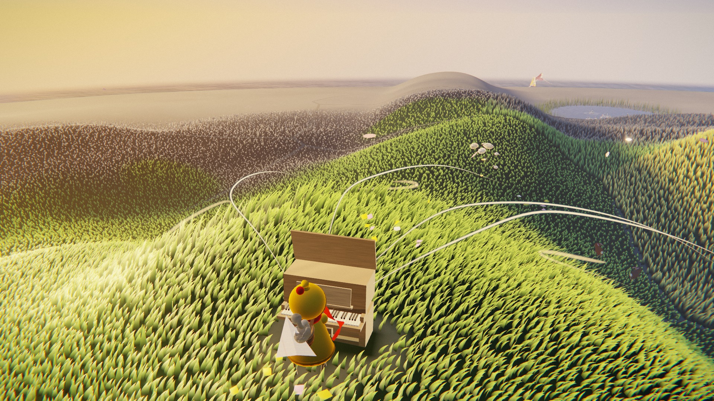
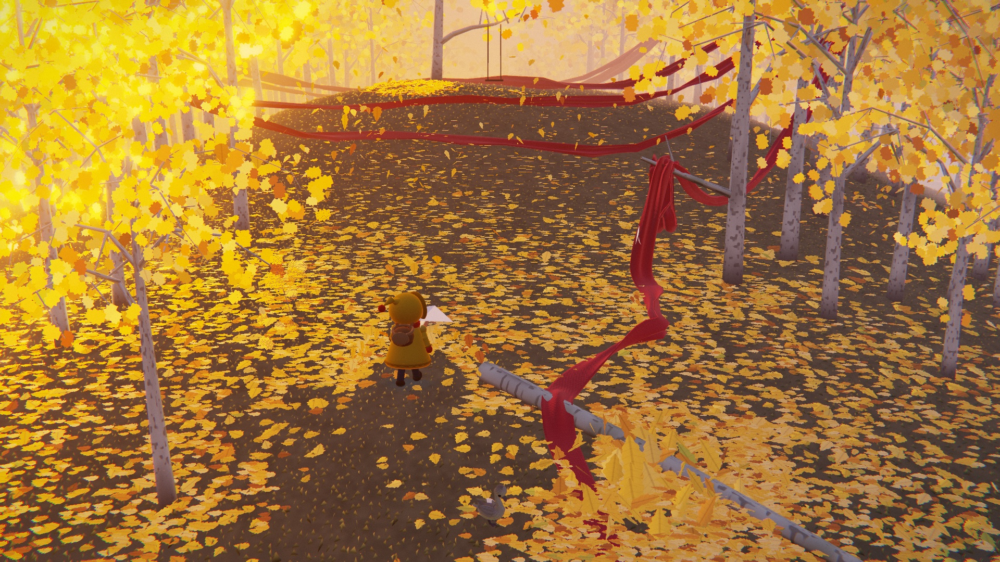
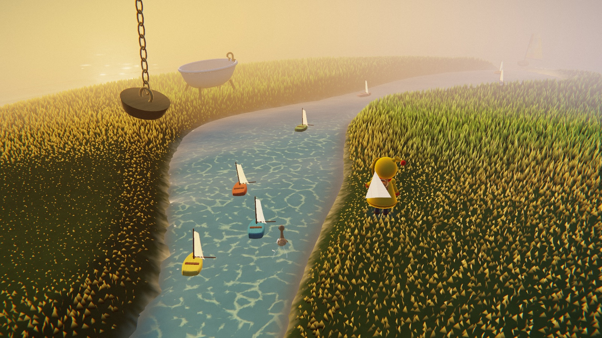
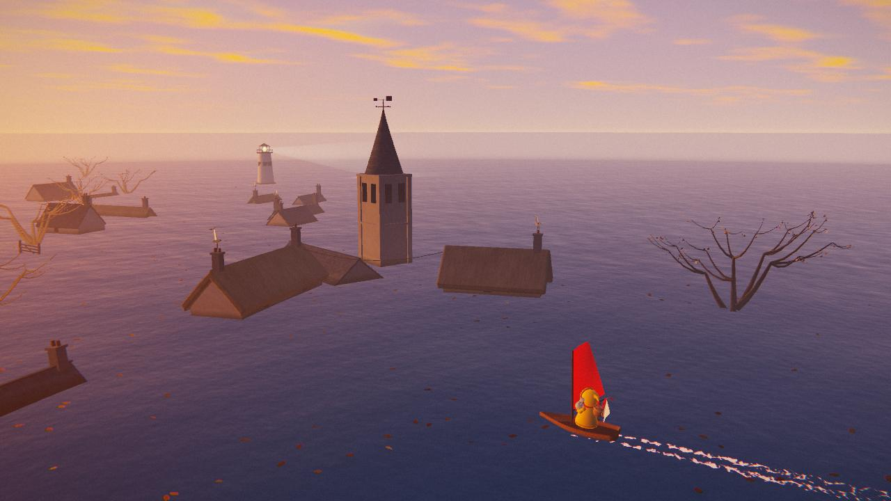
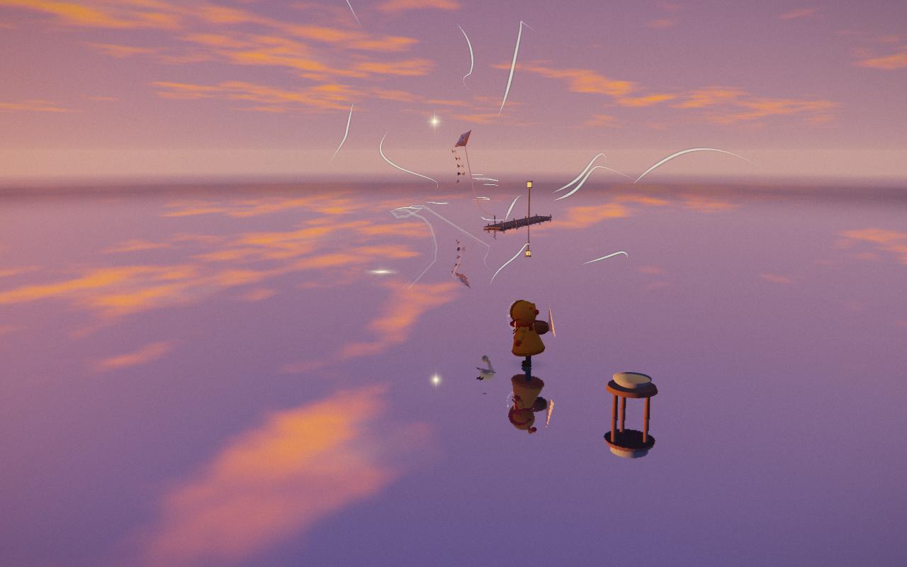

# Updraft

A quiet browser game where you play the wind.

[](https://updraft.perch-admin.workers.dev)

**[Play Updraft](https://updraft.perch-admin.workers.dev)**

You guide a child and a young swan from island to island by moving the air around them. A gust carries their paper plane, fills their sail and brings colour back to the land. They cross rolling meadows, autumn woods and a village half beneath the sea, finding small, unexpected things along the way.

The story is told without dialogue. Grass bends, washing billows and music answers your gestures. You can linger to play with the wind or help the travellers on their way.

<p>
  
  
</p>
<p>
  
  
</p>

## How to play

- Move the pointer with a mouse or trackpad, or swipe on a touchscreen, to make a gust.
- Trace circles to raise an updraft.

Turn sound on to hear the music respond. Progress saves at checkpoints in your browser; choose **Continue** when you come back.

## Run locally

You'll need Node.js 24 or newer, npm and Git.

```sh
git clone https://github.com/JeremyVun/Updraft.git
cd Updraft
npm ci
npm run dev
```

Open [localhost:5230](http://127.0.0.1:5230/) and choose **Begin**.

To check the types, build the game and preview the production build:

```sh
npm run typecheck
npm run build
npm run preview
```

The build writes to `dist/`. The preview command prints its local address.

## License

[MIT](LICENSE) © 2026 Jeremy Vun.

Three.js is also MIT-licensed. Its copyright and licence text are included in
[third-party notices](public/THIRD_PARTY_NOTICES.txt), which ship with the built game.
