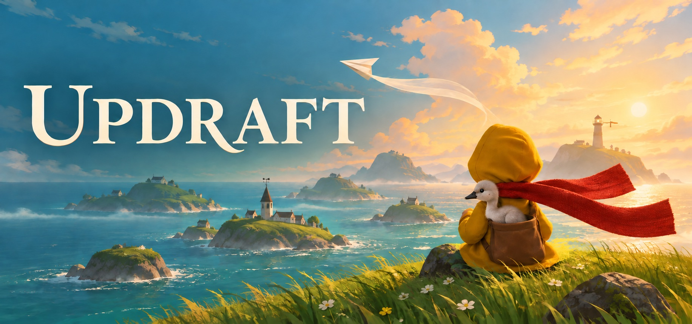
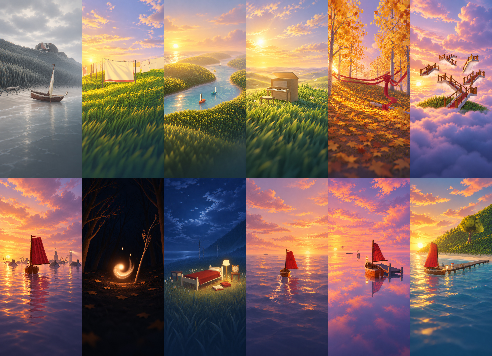

# Updraft

A little girl finds herself on an island far from home, with winter on the way. Together with a young swan, she sets
out to find the way home.

You are the wind. Lift her paper plane and she will follow it across the sea, through autumn woods and up into the
clouds. The swan trusts her, and the days are getting shorter. When the way goes dark, she will have to be brave for
both of them.

A wordless journey home, played with nothing but the movement of your hand.

Play it in your browser at [updraft.jeremyvun.com](https://updraft.jeremyvun.com).

## How to play

- Move the pointer with a mouse or trackpad, or swipe on a touchscreen, to make a gust.
- Trace circles to raise an updraft.

Play with sound on: the music responds to the wind. Progress saves at checkpoints in your browser, so choose
**Continue** when you come back.

## License

[MIT](LICENSE) © 2026 Jeremy Vun.

Three.js is also MIT-licensed. Its copyright and licence text are in the
[third-party notices](public/THIRD_PARTY_NOTICES.txt), which ship with the built game.
